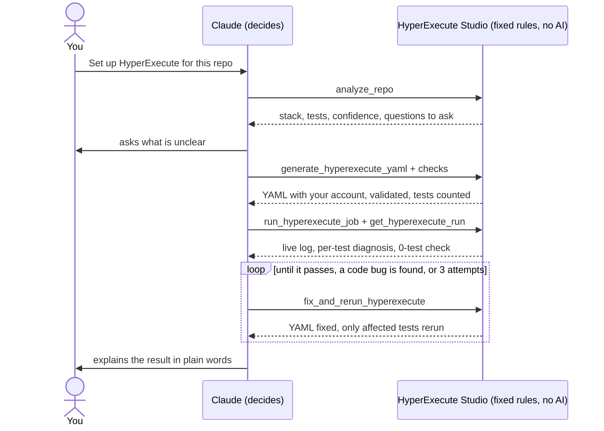

# HyperExecute Studio (MCP server + VS Code extension)

Reads a test-automation repo, detects its stack, and generates, validates and dry-runs a HyperExecute YAML. It uses a bundled knowledge base plus your live Confluence space (`HYP` on lambdatest.atlassian.net). There is also a browser-only version for customers in [`web/`](web/).

## HyperExecute Studio vs Claude

**HyperExecute Studio turns a customer's test repo into a checked, running HyperExecute setup in one conversation.** It is not a replacement for Claude: it is the set of HyperExecute tools that Claude (or Copilot) calls. Claude reads the request and decides; HyperExecute Studio does the work with fixed, tested rules, so the same repo always gives the same YAML.

| By the numbers (v1.7.1) | |
|---|---|
| **99.5%** correct on real repos | 215 of 216 checks across 45 cases, including 25 of LambdaTest's own sample repos |
| **22** test frameworks | Java, Node, Python, .NET, Ruby |
| **19** tools for Claude and Copilot | analyze, build, run, fix, CI |
| **148** automated checks | 87 for the core, 61 in a real browser for the web version |
| **10 files** in the protected `.vsix` | was 4,741 files, 6.4 MB |

### How they work together

You ask in plain words; Claude chooses each step and HyperExecute Studio carries it out.



### Side by side

| | Claude | HyperExecute Studio |
|---|---|---|
| What it is | A general AI model that understands language and reasons | An MCP server with 19 HyperExecute / LambdaTest tools, also shipped inside the VS Code extension and a browser version |
| Intelligence | Understands the request, plans the steps, writes and edits code | None: fixed rules for detection, YAML building, validation and log diagnosis |
| HyperExecute knowledge | General training knowledge; may be outdated or incomplete | Exact rules (v0.1 vs v0.2, the v0.2 `testDiscovery` 0-tests trap, `runson`, `$test`), a bundled knowledge base, 10 example YAMLs and the live Confluence `HYP` space |
| Access to your systems | Only the tools it is given | Your LambdaTest account, live browser/OS lists, local test discovery, the HyperExecute CLI, job logs and reports |
| Output | Can vary between runs | The same input always gives the same YAML and the same validation result |
| Measured accuracy | Not measured for HyperExecute | 100% on 20 fixture cases; 99.5% across 45 cases including 25 LambdaTest sample repos |
| Works on | Any task | HyperExecute test-automation repos: Java, Node, Python, .NET, Ruby |

### What each adds

**HyperExecute Studio** returns checked facts, not guesses:

| Job | Tools | What it gives Claude |
|---|---|---|
| Understand the repo | `analyze_repo` | Stack, tests, tags, env vars, Maven profiles, Gradle modules, workspace packages, plus confidence, assumptions and questions to ask |
| Build the YAML | `generate_hyperexecute_yaml`, `optimize_hyperexecute_yaml` | A YAML for the detected framework (v0.2 native runner or v0.1), with your saved LambdaTest account already in it; ranked speed and cost fixes |
| Check it | `validate_hyperexecute_yaml`, `dry_run_test_discovery` | Key, type and v0.1/v0.2 rule checks; the real list of tests discovered on your machine |
| Run and fix | `run_hyperexecute_job`, `get_hyperexecute_run`, `fix_and_rerun_hyperexecute`, `diagnose_hyperexecute_logs` | Live logs, a diagnosis per failed test, YAML fixes, reruns of only the affected tests, and a warning when a green job ran 0 tests |
| Run from CI | `generate_ci_pipeline` | A GitHub Actions, GitLab CI, Jenkins or Azure DevOps file that runs the YAML on every push, with the account from the CI's secrets |
| Stay safe | `scan_credentials_and_reporting`, `fix_hardcoded_credentials` | Hard-coded customer credentials and customer-side reporting (TestRail, Jira, Slack…) found before anything runs |
| Connect to LambdaTest | `set_lambdatest_credentials`, `lambdatest_credentials_status`, `generate_lambdatest_capabilities` | One saved account used everywhere; finds where the tests connect and what to change there, from live browser/OS lists |
| Know more | `search_knowledge_base`, `get_confluence_page`, `knowledge_base_status` | Search across the bundled notes, example YAMLs and Confluence, with synonyms |
| Get better | `review_diagnosis_feedback` | Failures it didn't recognize, grouped, so they become new rules |

**Claude** turns a request in plain words into the right tool calls, and handles whatever the rules don't cover:

- **Understanding**: "Windows 11, 10 VMs, split by scenario, tunnel for staging" becomes the right generator options.
- **Planning**: it picks which tools to call and in what order, and asks the analyzer's questions before generating.
- **Unusual cases**: odd repo layouts, custom runners, or a failure no rule recognizes; it reads the code or the log digest and proposes a YAML change, which HyperExecute Studio then validates.
- **Explaining**: it tells you why a YAML looks the way it does and what to fix, in your words.

### Why not ask Claude alone?

Claude alone can write a YAML that looks right; HyperExecute Studio catches the ways it goes wrong on the platform.

| What goes wrong | What HyperExecute Studio does |
|---|---|
| A v0.2 YAML with a `testDiscovery` block runs 0 tests | The validator refuses it before the job starts |
| The discovery command finds nothing on this repo layout (Cypress 9, pytest files not named `test_*`, Gradle modules) | Dry-run discovery runs it locally and shows the real count |
| The job goes green having run 0 tests | The discovery check compares the platform's count with the dry run and flags it |
| A test fails and is rerun again and again | Each failure is classified: code bugs are left alone; only YAML/environment failures are fixed and rerun |
| The customer's own LambdaTest key or reporting stays in the code | The scan finds it and replaces it with `LT_USERNAME` / `LT_ACCESS_KEY` |
| Keys and flags from memory are wrong or outdated | Rules and examples come from the HyperExecute docs and Confluence, and are tested |

## Tools
| Tool | What it does |
|---|---|
| `analyze_repo` | Detects language, build tool, framework, test classes/methods/files/features/scenarios, tags/groups, env vars the code reads, grid/hub usage, reports, Maven profiles, Gradle modules, workspace packages (npm/yarn/pnpm workspaces, Nx, Turborepo), npm test scripts, Playwright config/projects, pyproject extras and existing YAMLs. Returns **confidence** (high / medium / low), **assumptions** and **questions** to ask before generating |
| `generate_hyperexecute_yaml` | Builds the YAML: **v0.2** (native `framework:` runner) for Maven/Gradle TestNG/JUnit/Spock and .NET NUnit/MSTest, or **v0.1** (raw discovery) for everything else and for matrix mode (autosplit or matrix; split by class / method / suite / file / feature / scenario / tag; multi-OS; extra matrix axes; tunnel; secrets). `write: true` saves it to the repo |
| `validate_hyperexecute_yaml` | Lints v0.1 and v0.2 rules (including the v0.2 `testDiscovery` 0-tests trap), keys/typos, runson, `$test`, retries/timeouts, cache, hard-coded secrets, reports, and files referenced in the repo |
| `dry_run_test_discovery` | Runs the discovery command locally and shows what HyperExecute will split and how the first tasks expand |
| `search_knowledge_base` | Searches the bundled KB and Confluence together |
| `get_confluence_page` | Reads a full Confluence page (code/YAML blocks kept) |
| `knowledge_base_status` | Lists KB topics and tests the Confluence login |
| `scan_credentials_and_reporting` | Finds hard-coded LambdaTest usernames/access keys (masked) and integrations that report to the customer's side (TestRail, Jira/Xray, ReportPortal, Slack/Teams, email, Allure TestOps, Cypress Cloud, Percy/Applitools, other grids) |
| `fix_hardcoded_credentials` | Rewrites hard-coded credentials to read `LT_USERNAME` / `LT_ACCESS_KEY`. Dry run by default |
| `generate_lambdatest_capabilities` | Finds where the repo connects to a browser or device (driver creation, WebdriverIO/Nightwatch config, grid URLs in code or config files) and whether each place already uses LambdaTest, then gives the in-place change for each one in the repo's language (`LT:Options`, live browser/OS lists, Appium real devices for Java, Python, Node). Never creates or edits files: the agent tells you where the connection is and edits those lines only when you ask |
| `generate_ci_pipeline` | GitHub Actions, GitLab CI, Jenkins or Azure DevOps file that runs the YAML from the customer's CI: downloads the CLI, takes `LT_USERNAME` / `LT_ACCESS_KEY` from the CI secrets, fails the build on failure, keeps the logs |
| `optimize_hyperexecute_yaml` | Ranked speed/cost/reliability suggestions for a YAML; applies the ones you pick |
| `set_lambdatest_credentials` | Verifies and saves your LambdaTest account once (shared with the Studio) |
| `lambdatest_credentials_status` | Which account runs will use (key masked) |
| `run_hyperexecute_job` | Starts a watched job with the CLI (downloaded automatically) using your saved account; returns a runId |
| `get_hyperexecute_run` | Live log tail while running; when finished, a diagnosis (passed / fixable / test-failures / auth-error / needs-attention / unknown) with evidence and proposed YAML fixes |
| `fix_and_rerun_hyperexecute` | Applies the diagnosis fixes (or your YAML), validates, writes, and starts the next attempt. Per test: code failures are left alone; tests that failed for YAML/environment reasons get the fix and are rerun on their own. Takes `values` for env vars the tests need. Refuses for code-only failures, login errors, or after max attempts |
| `diagnose_hyperexecute_logs` | Diagnoses pasted logs or a downloaded log folder and returns the corrected YAML |
| `review_diagnosis_feedback` | Groups the failures the rules didn't recognize (saved locally, masked) and shows how each rule's fixes worked out: applied, overridden, or the next attempt failed the same way. `markReviewed` clears a group once a rule covers it |

Prompt: `create_hyperexecute_yaml` runs the whole workflow.

Supported: Java (Maven/Gradle), including TestNG, JUnit 4/5, Spock and Cucumber · Node, including Playwright, Cypress, WebdriverIO, cucumber-js, Jest, Mocha, Nightwatch and TestCafe · Python, including pytest, Behave and Robot · .NET, including NUnit, xUnit, MSTest, SpecFlow and Reqnroll · Ruby, including RSpec and Cucumber/Capybara.

## Setup
```bash
cd /Users/roshank/Downloads/hyperMCP && npm install && npm test
```

**VS Code (Copilot agent mode):** copy `examples/vscode-mcp.json` to `<your-automation-repo>/.vscode/mcp.json`, or add it to your user MCP config via *MCP: Open User Configuration*. Start the server from the file, and VS Code prompts once for your Atlassian email and token, then stores them encrypted.

**Claude Code (available in every repo).** Your LambdaTest account is saved once (Studio Setup card, or the `set_lambdatest_credentials` tool) in `~/.hyperexecute-studio/credentials.json` and used everywhere:
```bash
claude mcp add hyperexecute -s user -- npx -y github:roshanLambdatest/HyperMCP
# optional Confluence: add  -e ATLASSIAN_EMAIL=you@lambdatest.com -e ATLASSIAN_API_TOKEN=<token>  before the --
```
The server (named `hyperexecute`) analyzes the folder Claude Code is running in. Upgrading from 1.7.0 or older? Remove the old name first: `claude mcp remove hyperexecute-yaml -s user`. Needs Node.js 18+.

**Fewer approval prompts.** To let Claude Code analyze, generate, validate, diagnose and remember without asking, while still asking before it starts a job, reruns one or edits your code or saved account, add this to `permissions` in `~/.claude/settings.json`:
```json
"allow": ["mcp__hyperexecute__analyze_repo", "mcp__hyperexecute__generate_hyperexecute_yaml", "mcp__hyperexecute__validate_hyperexecute_yaml", "mcp__hyperexecute__dry_run_test_discovery", "mcp__hyperexecute__optimize_hyperexecute_yaml", "mcp__hyperexecute__search_knowledge_base", "mcp__hyperexecute__get_confluence_page", "mcp__hyperexecute__knowledge_base_status", "mcp__hyperexecute__scan_credentials_and_reporting", "mcp__hyperexecute__generate_lambdatest_capabilities", "mcp__hyperexecute__generate_ci_pipeline", "mcp__hyperexecute__get_hyperexecute_run", "mcp__hyperexecute__diagnose_hyperexecute_logs", "mcp__hyperexecute__lambdatest_credentials_status", "mcp__hyperexecute__review_diagnosis_feedback", "mcp__hyperexecute__remember_for_team"],
"ask": ["mcp__hyperexecute__run_hyperexecute_job", "mcp__hyperexecute__fix_and_rerun_hyperexecute", "mcp__hyperexecute__fix_hardcoded_credentials", "mcp__hyperexecute__set_lambdatest_credentials"]
```
`generate_hyperexecute_yaml` and `generate_ci_pipeline` still write a file only when asked to (`write: true`).

## How it gets better with use

Claude can't be retrained, but the agent around it learns from real use. Personal data stays on the machine (`~/.hyperexecute-studio`); `HE_LEARN=off` turns it off. Team memory lives in the repo, so it travels with git.

- **Playbook for any AI client.** The MCP server sends its workflow and rules (ask before guessing, check existing YAMLs first, never rerun code failures, a 0-test pass is a failure) as MCP instructions when a client connects, so Claude and Copilot follow them without being told.
- **Claude Code skill.** `claude-skill/hyperexecute-studio/SKILL.md` loads automatically for anything about HyperExecute. Install it once: `mkdir -p ~/.claude/skills && cp -r claude-skill/hyperexecute-studio ~/.claude/skills/`.
- **Team memory in the repo.** `.hyperexecute/team.json` in the tested repo holds what the team decided (OS, VMs, split, Maven profile, env values) and notes every teammate's agent should follow. Passing runs update it; `remember_for_team` saves a decision ("always win11 for this repo", "staging needs the tunnel"). Commit it and review changes like code. Precedence: explicit options, then team, then usual settings. Credentials are refused; `HE_TEAM_MEMORY=off` turns it off.
- **Usual settings.** Options chosen the same way twice for a framework (OS, VMs, split, retries, timeout, tunnel) become the starting point for that framework. The reply says so; explicit options or `useLearned: false` override. The web version remembers them per browser.
- **Passing runs become accuracy cases.** Every job that passes saves its repo and YAML (credentials as references only) to `~/.hyperexecute-studio/accuracy-cases`, which `npm run accuracy` checks by default, so a change that breaks a setup that really worked is caught.
- **Unrecognized failures** are saved for the weekly rule review (below).

## Accuracy check
```bash
npm run accuracy                      # generate a YAML for every case and compare with what's known to be right
npm run accuracy -- --verbose         # show every check
npm run accuracy -- --update-baseline # accept the current score
```
It fails when the score drops below `test/accuracy/baseline.json`. Committed cases (`test/accuracy/cases/*.json`) use the fixtures. For real customer repos, keep cases **outside the repo** and point `HE_ACCURACY_CASES` at them. Each case is a folder:
```
$HE_ACCURACY_CASES/acme-checkout/
  case.json       { "options": { "splitBy": "method" }, "expected": { "framework": "testng" } }   (optional)
  expected.yaml   the hand-tuned YAML that ran correctly on HyperExecute
  repo/           a copy of the repo (or "repo": "/abs/path" in case.json)
```
**LambdaTest's public samples** (github.com/LambdaTest) make a ready reference set: `scripts/fetch-sample-cases.sh ~/he-accuracy-cases` clones 22 sample repos and builds 23 cases from their YAMLs; then `HE_ACCURACY_CASES=~/he-accuracy-cases npm run accuracy`. Committed and private cases have separate baselines. Only correctness checks count toward the score; runner flags and env names that the reference YAML chose are shown as `~` (style match), not errors. `ignore` in case.json skips checks where the reference uses a different strategy on purpose.

From `expected.yaml` it checks runson, YAML version, v0.2 runner, runner flags, env keys and the discovered count (both discovery commands are run in the repo). Every time a YAML is fixed by hand, add it as a case.

## Unrecognized failures (rule review)
When a run or pasted log comes back `unknown` / `needs-attention`, or some failed tests can't be classified, the unexplained part is saved to `~/.hyperexecute-studio/feedback/unmatched/`: credentials, tokens, emails and the saved LambdaTest account are masked. Nothing leaves the machine. Every applied fix, custom-YAML override and attempt result goes to `outcomes.jsonl`.

Weekly: `npm run feedback` (or the `review_diagnosis_feedback` tool) → for each recurring group add a rule to `src/doctor.js` plus a smoke test from the masked digest → mark it reviewed. Rules listed as overridden or "next attempt same failure" need a look too. Turn it off with `HE_FEEDBACK=off`.

## Discovery check
`dry_run_test_discovery` remembers the count. When a watched run finishes, `get_hyperexecute_run` returns `discoveryCheck`, which compares the dry run (or the analyzer's test count) with the count HyperExecute printed and the test cases in the downloaded reports. A job that goes green having discovered 0 tests is not reported as passed.

## Knowledge base
- **Bundled** (`knowledge/*.md`): YAML key reference, framework recipes, troubleshooting and a pre-sales checklist. Add your own `.md` or golden `.yaml` files here, or point `HE_KB_DIR` at a folder. They get indexed automatically.
- **Golden YAMLs** (`knowledge/golden/*.yaml`): one per tricky setup (v0.2 runners, Maven profiles, Gradle multi-module, Cucumber tags, Playwright custom config/projects, workspace monorepo, pytest with pyproject + xdist, .NET multi-project). The comment header says what the case is and its pitfalls. These started as generator output: replace each with a YAML verified on HyperExecute when you have one.
- **Search** is BM25 with light stemming and HyperExecute synonyms, so "tests not found" finds "Discovery finds 0 tests".
- **Confluence cache**: every page read with `get_confluence_page` is saved to `~/.hyperexecute-studio/kb-cache/` and searched with the local KB, so it still works offline or without the Atlassian login.
- **Confluence** (live): set `ATLASSIAN_EMAIL` + `ATLASSIAN_API_TOKEN`. The same Atlassian API token works for Jira and Confluence (create one at https://id.atlassian.com/manage-profile/security/api-tokens). Optional: `CONFLUENCE_BASE_URL`, `CONFLUENCE_SPACE` (comma-separated), and `ATLASSIAN_AUTH=bearer` for a Data Center PAT.

## Env
| Var | Default |
|---|---|
| `HE_DEFAULT_REPO` | cwd, i.e. the repo used when a tool gets no `repoPath` |
| `HE_KB_DIR` | extra knowledge folder |
| `CONFLUENCE_BASE_URL` | `https://lambdatest.atlassian.net/wiki` |
| `CONFLUENCE_SPACE` | `HYP` |
| `HE_YAML_SCHEMA` | path to an official HyperExecute JSON schema; the validator applies it on top of its own rules |
| `HE_FEEDBACK` / `HE_FEEDBACK_DIR` | `off` disables saving unrecognized failures / where they go (default `~/.hyperexecute-studio/feedback`) |
| `HE_KB_CACHE_DIR` | Confluence page cache (default `~/.hyperexecute-studio/kb-cache`) |
| `HE_ACCURACY_CASES` | folder of private accuracy cases |

## Releasing the VS Code extension
`npm run package` (in `vscode-extension/`) builds a **protected** `.vsix`: the code, knowledge base and dependencies are bundled into three minified, obfuscated files, with no readable source, folders, `node_modules` or knowledge files inside (10 files, ~1.2 MB). This makes the code hard to read, not impossible, because VS Code has to run it. `npm run package:dev` builds the old readable package for debugging.

1. Bump `version` in `vscode-extension/package.json` (e.g. `1.2.0`) and commit.
2. `git tag v1.2.0 && git push origin main --tags`
3. GitHub Actions runs the tests, builds `hyperexecute-studio.vsix`, and attaches it to the **v1.2.0** release.

Teammates install it from the Releases page: download the `.vsix`, then in the Extensions view choose `⋯` → **Install from VSIX…**, then run **Developer: Reload Window**.

## LambdaTest account: saved once, used everywhere
- Save it once: Studio **Setup → LambdaTest account**, or the `set_lambdatest_credentials` MCP tool. It's verified against LambdaTest, then stored in `~/.hyperexecute-studio/credentials.json` (readable only by you). The Studio also keeps a copy in VS Code's secret storage.
- The CLI gets it through its environment. The HyperExecute CLI itself is downloaded automatically to `~/.hyperexecute-studio/bin/`.
- Once saved, **generated YAMLs contain your account** (`LT_USERNAME` / `LT_ACCESS_KEY`), so you never edit them. The MCP's chat replies show the key masked; the file on disk has the real one. Don't commit such a YAML to a shared repo or send it to a customer. To use `${{ .secrets.* }}` references instead (safe to commit), untick **Put my username & key into generated YAMLs** in Studio Setup, pass `embedCredentials: false`, or set `HE_EMBED_CREDENTIALS=off`. With references, each run passes the CLI a short-lived copy with your values filled in, then deletes it.
- Your own account inside a HyperExecute YAML is not reported by the credential scan; a customer's credentials in their code still are.
